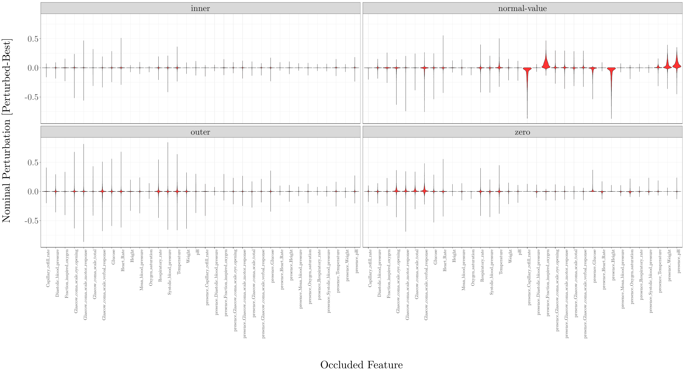

## MIMIC-III Benchmarks IHM Occlusion Analysis

Explainability in AI is a crucial research field, particularly in the biomedical domain where results derived from machine-learning models could help to make important decisions for hospitals.

In this repository, we conduct an occlusion (perturbation) analysis of the MIMIC-III benchmarks best in-hospital-mortality (IHM) model. The MIMIC-III benchmark model(s) are detailed in [Harutyunyan et al. 2019](https://arxiv.org/abs/1703.07771), with open-source code being found [here](https://github.com/YerevaNN/mimic3-benchmarks).

### Table of Contents
1. [Dependencies](#1-Dependencies) 
2. [Repository initialization](#2-Repository-initialization)
3. [Occlusion pipeline](#3-Occlusion-pipeline)
4. [Visualization](#4-Visualization)
5. [Interpretation](#5-Interpretation)
6. [Acknowledgments](#6-Acknowledgments)

### 1. Dependencies

**i.** In order to set up this repository, we would need to satisfy local pythonic dependencies. If `poetry` is installed on your system, you can install dependencies and create a virtual environment automatically via the following command:

```shell
$ poetry install
```

Alternatively, you can install dependencies with `pip`:

```shell
$ pip install -r requirements.txt
```

**Note**: Your python version must be `3.7.*` in order to install certain dependencies in this repository. 

**ii.** In this repository, we use `R` and `ggplot` for visualization. Execute the following within your R console to get the dependencies:

```r
> install.packages(c("tools","ggplot2","tikzDevice","reshape2","optparse"))
```

**Note:** R-scripts were tested with R version `3.6.*`.

### 2. Repository initialization

In order to populate this repository with the necessary data, follow these steps:

**i.** Clone the `MIMIC-III` benchmarks [repository](https://github.com/YerevaNN/mimic3-benchmarks) and initialize input data for the In-Hospital-Mortality (IHM) task. This process can take a long period of time and also requires the user to undertake a medical ethics examination in order to download the `MIMIC-III` raw data.

**ii.** After processing the IHM data, create a symlink from the `MIMIC-III` benchmark IHM data to `./data` in order to access the data in this repository:

```shell
$ cd ./data && ln -s {path-to-mimic3-repo}/data/in-hospital-mortality/ .
```

**iii.** Next, run `init.sh` in order to set up some final features:

```shell
$ ./init.sh
```

**iv**. The first prompt will ask if you want to initialize a pre-commit hook for keeping python-dependencies up-to-date. If you aim to further develop this repository, then answer yes for this prompt.

**v.** The next prompt will ask if you want to download and deploy the best `MIMIC-III` benchmark models. Answer yes for this, as this step is necessary.

### 3. Occlusion pipeline

In order to conduct occlusion on the `MIMIC-III` benchmark IHM dataset, we developed functions within `occlude.py`. We provide code for four types of occlusion; namely zero, normal-value, inner and outer occlusion. Details regarding each of these occlusions can be found in the py-docstring documentation in `occlude.py`. Below is a usage script:

```
$ python3 occlude.py --help

usage: occlude.py [-h] [--occlusion-type str] [--n-iterations int]

optional arguments:
  -h, --help            show this help message and exit
  --occlusion-type str  type of occlusion to conduct, either 'zero', 'normal-
                        value', 'inner', 'outer' or 'all' (default: all)

arguments specific to inner/outer occlusion:
  --n-iterations int    number of permutation iterations for inner/outer
                        occlusion (default: 5)
```

An example of running this script would be:

```shell
$ python3 occlude.py --occlusion-type all --n-iterations 10
```

This pipeline will compute original and occluded model scores and will output them as `csv` files within the `./output` directory.

### 4. Visualization

In order to visualize the results from the `csv` files, simply run the following:

```shell
$ Rscript vis.R
```

The corresponding visualizations will be converted to latex code within the `tikz` framework and will then be saved as pdf's in the `./img` directory.

**Note:** This requires all the corresponding `csv` files to be present.

### 5. Interpretation

Based on the results of the perturbation, we can already interpret some interesting results. Below, we have one of the visualizations produced from the step before.

<p align="center">

</p>

This visualization shows nominal perturbations recorded during occlusion. `normal-value` on the top-right refers to replacing features of interest marginally by their `normal-value` or healthy values, which were suggested by medical experts. We shall focus on `normal-value` occlusion for this interpretation.

Most features show non-clustered and generally widely distributed perturbations. The exception are the `presence*` features, which are binary features which indicate `1` when the feature was present in the timestep and `0` if the feature was absent during the timestep and needed to be imputed.

For the `presence*` features, we assumed the `normal` values would be `1`, since in a normal scenario, all features should be recorded for all timesteps. By doing this, we can see significant and clustered perturbations for the `presence*` features.

In particular, we can see that if (by chance) more `capillary_refill_rate` measurements were taken (such that `capillary_refill_rate` did not need to be imputed), the model's prediction probability for mortality decreases significantly. This could pose a risk of false negatives for mortality.

### 6. Acknowledgments

**@YerevaNN** for their MIMIC-III benchmark code, which was mildly re-factored for use in `./utils`
